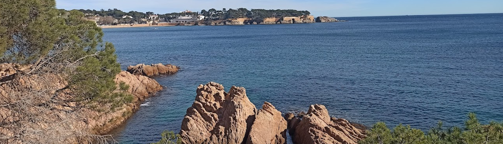
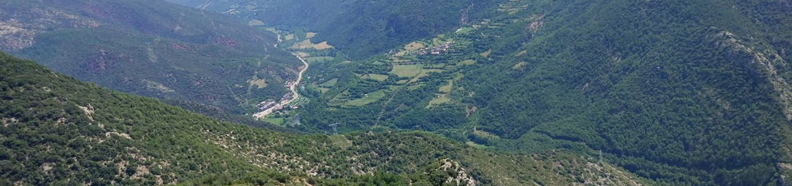

<h1> Hi, my name is Jonas :wave:</h1>

<h2> About me</h2>
Full Stack Developer (Web), backend focused.
 

 
<li>:man_student: I studied Computer Science at University (completed in 2020)</li>
<li>:desktop_computer: I work as a software developer in a start-up </li>
<li>:earth_americas: I’m from Spain </li>
<li>:loudspeaker: I’m a hardworking and a very talkative person </li>
<li>:couple: I really enjoy meeting new people </li>
<li>:books: I love books, especially non-fiction books</li>
<li>:mountain: I like motorbikes and adventures in my town</li>

<h2> Technologies</h2>
TODO

<h2> Some Projects</h2>
TODO

<h2> Social networks</h2>

  
  
  

 
 

  
  

<i>Be yourself, everyone else is already taken.</i> 
<i>Oscar Wilde</i>
